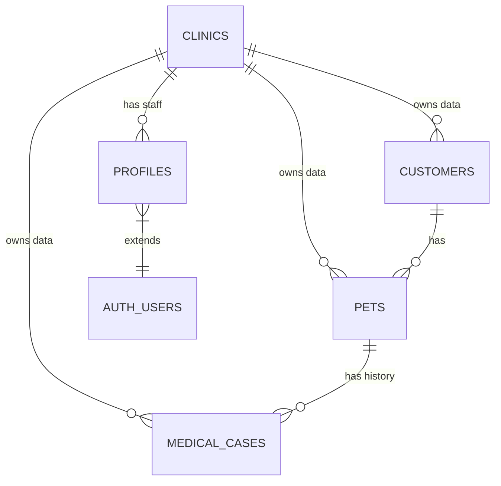

# 🎨 DESIGN: Okada Vet Clinic System Architecture

**Ngày cập nhật:** 2026-02-01
**Phiên bản:** 2.0 (Multi-tenancy Standard)

Tài liệu này mô tả kiến trúc Cloud chuẩn cho hệ thống **Multi-tenant SaaS** (Phần mềm dịch vụ cho nhiều phòng khám), đảm bảo bảo mật, hiệu năng và khả năng mở rộng.

---

## 1. ☁️ Cloud Architecture (Kiến trúc Đám mây)

Chúng ta sử dụng mô hình **Shared Database, Shared Schema** (Chung Database, Chung Cấu trúc) - đây là chuẩn công nghiệp cho các ứng dụng SaaS hiện đại (như Slack, Discord, Notion) chạy trên PostgreSQL/Supabase.

### 1.1. Nguyên lý cốt lõi: "Discriminator Column"
Mọi bảng dữ liệu đều phải có cột `clinic_id` để phân biệt dữ liệu của phòng khám nào.

| id (PK) | clinic_id (FK) | name | ... |
|---|---|---|---|
| case_01 | clinic_A | Mèo Mun | ... |
| case_02 | clinic_B | Chó Vàng | ... |

*(Dữ liệu nằm chung bảng vật lý nhưng bị chia cắt về mặt logic)*

### 1.2. Bảo mật: Row Level Security (RLS)
Tuyệt đối **KHÔNG** lọc dữ liệu bằng code (`WHERE clinic_id = ...`) ở phía Client vì rất dễ bị hack.
Chúng ta sử dụng **RLS Policies** của PostgreSQL để chặn ngay từ cửa Database.

**Quy tắc vàng:**
> "Một user chỉ được nhìn thấy các dòng dữ liệu có `clinic_id` trùng với `clinic_id` trong hồ sơ (`profiles`) của họ."

```sql
-- Chính sách chuẩn (Pseudo-code)
CREATE POLICY "Tenant Isolation" ON medical_cases
USING (
  clinic_id IN (
    SELECT clinic_id FROM profiles WHERE id = auth.uid()
  )
);
```

### 1.3. Sơ đồ CSDL (Entity Relationship)



---

## 2. 👥 Employee Management (Quản lý Nhân sự)

### 2.1. Bản vẽ chi tiết (Schema V3)
> **[Xem file chi tiết: schema.sql](file:///C:/Users/Administrator/.gemini/antigravity/brain/d1e5b3dc-8623-4277-8810-03d061118751/schema.sql)**

Schema V3 này được thiết kế theo triết lý "Strict Core, Flexible Details" để bạn dùng 5-10 năm không cần đập đi xây lại:
1.  **Core Tables**: Người, Vật nuôi, Sản phẩm, Hóa đơn (Cấu trúc cứng, chặt chẽ).
2.  **Flexible JSON**: Các trường như `settings` (cấu hình in ấn, thuế), `preferences` (màu sắc app), `medical_history` dùng kiểu JSONB. Để sau này bạn muốn thêm tính năng nhỏ thì không cần sửa cấu trúc Database.
3.  **Future Features**: Đã chờ sẵn các cột cho:
    *   `subscription_tier`: Quản lý gói cước (Free/Pro).
    *   `loyalty_points`: Tích điểm khách hàng.
    *   `clinic_invites`: Mời nhân viên.
    *   `inventory_transactions`: Kho vận nâng cao (Lô, Hạn sử dụng).

### 2.2. Cấu trúc dữ liệu chi tiết

#### Bảng `profiles` (Hồ sơ nhân viên)
- `id`: UUID (Khớp với Auth User)
- `clinic_id`: UUID (Thuộc phòng khám nào)
- `role`: ENUM ('owner', 'vet', 'assistant', 'receptionist')
- `full_name`: TEXT
- `is_active`: BOOLEAN (Để khóa tài khoản)

#### Bảng `clinic_invites` (Lời mời)
- `id`: UUID
- `clinic_id`: UUID
- `email`: TEXT (Email người được mời)
- `role`: TEXT
- `code`: TEXT (Mã 6 số để join)
- `expired_at`: TIMESTAMP

### 2.2. Quy trình "Invite & Join" (Chuẩn SaaS)

**Bước 1: Chủ phòng khám mời (Invite)**
1.  Owner vào: *Settings > Nhân viên > Thêm mới*.
2.  Nhập Email: `bacsi@gmail.com`.
3.  Chọn quyền: `Veterinarian`.
4.  Hệ thống tạo bản ghi `clinic_invites` và sinh mã `123456`.

**Bước 2: Nhân viên tham gia (Join)**
1.  Nhân viên tải App, chọn "Đăng ký".
2.  Nhập Email `bacsi@gmail.com`.
3.  Hệ thống phát hiện Email này đang có lời mời chờ.
4.  Yêu cầu nhập mã xác thực (`123456`).
5.  Nếu đúng: Tạo User mới -> Tự động gắn `clinic_id` và `role` từ lời mời vào `profiles`.

---

## 3. 🛡️ Authorization (Phân quyền chi tiết)

Ngoài việc chia tách dữ liệu theo phòng khám, trong nội bộ phòng khám cũng cần phân quyền theo vai trò.

| Quyền hạn | Owner (Chủ) | Vet (Bác sĩ) | Receptionist (Lễ tân) |
|---|---|---|---|
| **Khách hàng/Thú cưng** | Xem/Sửa/Xóa | Xem/Sửa | Xem/Sửa |
| **Bệnh án** | Xem/Sửa/Xóa | Xem/Sửa | Xem (Không sửa chuyên môn) |
| **Kê đơn/Thuốc** | Full | Full | Xem |
| **Báo cáo/Doanh thu** | **Full** | **Không** | **Không** |
| **Quản lý nhân viên** | **Full** | **Không** | **Không** |
| **Cấu hình hệ thống** | Full | Xem | Xem |

---

## 4. 🗄️ Storage Isolation (Lưu trữ file)

File ảnh (X-quang, Siêu âm, Avatar) cũng cần được cách ly.

**Bucket Structure:**
`/{clinic_id}/{year}/{case_id}/{filename}`

**Storage RLS Policy:**
User chỉ được xem/upload file nếu đường dẫn bắt đầu bằng `{clinic_id}` của họ.

---

## 5. 🔐 Security & Licensing (Bảo mật & Bản quyền)

Bạn hỏi về "Gắn Key vào máy" - đây là tính năng Device Binding. Trong mô hình này, ta xử lý như sau (đã thêm vào Schema V3):

### 5.1. Cơ chế License Key
- Bảng `clinics` có cột `license_key`.
- Key này định nghĩa gói cước (`subscription_tier`) và giới hạn số thiết bị.

### 5.2. Cơ chế Device Binding (Gắn máy)
- Bảng `clinic_devices` lưu danh sách máy được phép truy cập.
- **Luồng hoạt động:**
    1. Khi đăng nhập, App gửi `DeviceId` (Lấy từ phần cứng mainboard/disk).
    2. Server kiểm tra: Máy này có trong danh sách `Approved` của phòng khám không?
    3. Nếu **Không**: Chặn đăng nhập, báo "Thiết bị lạ".
    4. Owner nhận thông báo, bấm "Duyệt" -> Máy đó mới được vào.

=> **Kết luận:** Vẫn dùng chung Schema, không cần tách riêng. Nhờ vậy bạn quản lý tập trung được: "Phòng khám A đang dùng 3 máy nào, Key hết hạn chưa" ngay trên cùng 1 hệ thống.

---

## 6. ✅ Checklist Triển khai

### Phase 1: Database Foundation (Đã xong)
- [x] Thêm cột `clinic_id` vào tất cả các bảng.
- [x] Tạo bảng `clinics` và `profiles`.

### Phase 2: Security Layer (Cần làm ngay)
- [ ] Bật RLS (Enable Row Level Security) cho tất cả các bảng.
- [ ] Viết Policy "Tenant Isolation" cho từng bảng.
- [ ] Viết Policy "Role-based Access" (Phân quyền vai trò).

### Phase 3: Deployment & Updates (Mới)
- [ ] **Data Migration**: Chạy script tạo bảng trên Cloud.
- [ ] **Auto-Update System**:
    - Tạo bucket `updates` trên Supabase Storage.
    - Upload `version.json`, `app-release.apk` (Android), `setup.exe` (Windows).
    - Code logic trong App: Tự kiểm tra version khi mở app và tải file cài đặt tương ứng với hệ điều hành.

### Phase 3: Invite System (UI)
- [ ] Màn hình "Quản lý nhân viên".
- [ ] Dialog "Mời nhân viên".
- [ ] Màn hình "Đăng ký bằng mã mời".

---

## 7. 🔄 Hệ thống Tự động Cập nhật (Auto-Update)

Để đảm bảo cả Máy tính và Điện thoại đều tự cập nhật mà không mất dữ liệu, chúng ta sử dụng cơ chế **OTA (Over-The-Air)** đơn giản:

1.  **Server (Supabase Storage):** Chứa folder `updates` gồm:
    *   `version.json`: `{"latest_version": "1.0.1", "force_update": false, "notes": "Sửa lỗi in ấn..."}`
    *   `android/app-release.apk`: File cài đặt cho điện thoại.
    *   `windows/setup.exe`: File cài đặt cho máy tính.

2.  **Client (Ứng dụng):**
    *   Khi mở App -> Gọi API đọc `version.json`.
    *   So sánh `current_version` (ví dụ 1.0.0) với `latest_version` (1.0.1).
    *   Nếu cũ hơn -> Hiện Popup: "Có bản mới! Tải ngay?".
    *   Nếu User bấm "Có":
        *   **Android:** Tải `.apk` -> Mở trình cài đặt -> Ghi đè (Dữ liệu giữ nguyên).
        *   **Windows:** Tải `.exe` -> Mở trình cài đặt -> Ghi đè (Dữ liệu giữ nguyên).

---

*Thiết kế bởi Antigravity Solution Architect*
